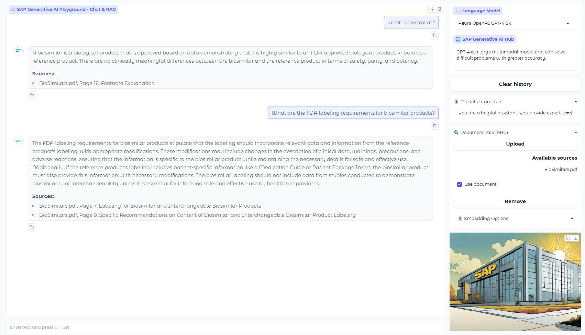

# README.md

## AI Playground Template

Welcome to the AI Playground Template project! This project is designed to provide a template for building a conversational AI interface using Gradio, LangChain, and SAP Generative AI Hub. It includes the ability to upload documents, embed them into SAP HANA Cloud Vector Store Engine, and use a Retrieve-Augment-Generate (RAG) approach for question-answering tasks.



### Features

- Conversational AI interface with Gradio Blocks
- Support for multiple language models from SAP Generative AI Hub
- Document upload and embedding into HANA Cloud Vector Store
- Retrieve-Augment-Generate (RAG) functionality for context-aware responses
- Customizable system roles for the AI assistant
- Easy environment configuration via `.env` file

### Prerequisites

To run the playground locally, you need the following SAP BTP Services provisioned:

- SAP AI Core with the `Extended` plan. The [discovery center explains the plan details](https://discovery-center.cloud.sap/serviceCatalog/sap-ai-core?region=all&tab=service_plan).
- SAP AI Launchpad service to control the AI Core with a graphical user interface. Mode details in the [Discovery Center](https://discovery-center.cloud.sap/serviceCatalog/sap-ai-launchpad?region=all).
- SAP HANA Cloud Vector Store Engine to allow for Retrieve-Augment-Generate use cases. More details in the [help document](https://help.sap.com/docs/hana-cloud-database/sap-hana-cloud-sap-hana-database-vector-engine-guide/sap-hana-cloud-sap-hana-database-vector-engine-guide?locale=en-US).

Before you can run the project, you need to have the following installed:

- Python 3.11 or higher
- Required Python packages (see `requirements.txt` for a full list)

### Installation

1. Clone the repository to your local machine.
2. Install the required Python packages using pip:

```bash
pip install --no-deps -r requirements.txt
```

3. Create a `.env` file in the root directory of the project and add the necessary environment variables:

```plaintext
EMBEDDING_MODEL=text-embedding-ada-002
# GenAI Hub Proxy credentials
AICORE_CLIENT_ID=sb-21b3e....|aicore!b540
AICORE_CLIENT_SECRET=...
AICORE_AUTH_URL=https://<your url>.authentication.eu10.hana.ondemand.com/oauth/token
AICORE_BASE_URL=https://<your api url>.ml.hana.ondemand.com/v2
AICORE_RESOURCE_GROUP=<your resource group, maybe 'default'>
# Host settings for gradio
HOSTPORT=51001
# HANA Connection data
HOST = <your hand cloud vector store url>.eu10.hanacloud.ondemand.com
HANA_USERNAME = <your HANA Cloud username>
HANA_PASSWORD = <your HANA Cloud password>
```

Replace the placeholders with your values.

### Usage

To start the AI Playground, run the `genai_playground.py` script:

```bash
python genai_playground.py
```

The Gradio interface will be available at `http://localhost:51040` (or the host and port you specified in your `.env` file).

### Project Structure

- `genai_playground.py`: Main script that sets up the Gradio interface and handles the conversational AI logic.
- `genai_utils.py`: Utility functions for embedding documents, connecting to HANA Cloud, and initializing language models.
- `models.json`: Configuration file for language models available through SAP Generative AI Hub.
- `settings/`: Directory containing configuration files like `models.json`.
- `img/`: Directory containing images used in the Gradio interface.

### Deployment on SAP BTP
To deploy the playground within your company, you use a runtime like Cloud Foundry or Kyma and secure it like any other application. For Kyma there is a [detailed blog which I've written](https://www.linkedin.com/pulse/sap-btp-kyma-authentication-authorization-autoscaling-gunter-albrecht-wrbic/) that considers authenticaton and authorization as well as scaling up/down based on load.

### Documentation
- [Detailed Setup Guide](./documentation/SETUP_GUIDE.md)
    - SAP BTP configuration
    - Environment variables setup
    - Docker deployment
    - Kyma deployment
    - Troubleshooting common issues
- [Architecture diagram](./docs/Architecture_Diagram.png)
- [Demo Video with usecase]()

### Contributing

Contributions to the AI Playground Template are welcome! Please feel free to submit pull requests or create issues for bugs and feature requests.

### License

This project is licensed under the MIT License - see the LICENSE file for details.

---

**Note:** This README is a template and should be customized to fit the specifics of your project.
