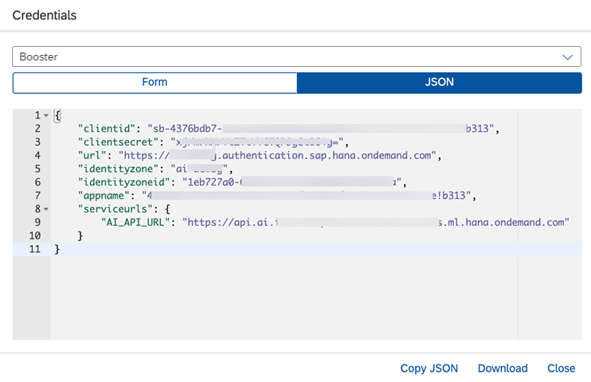
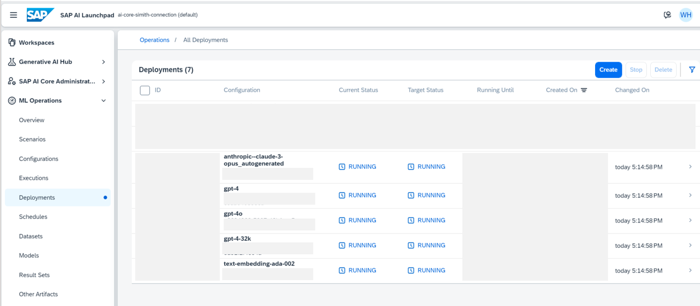
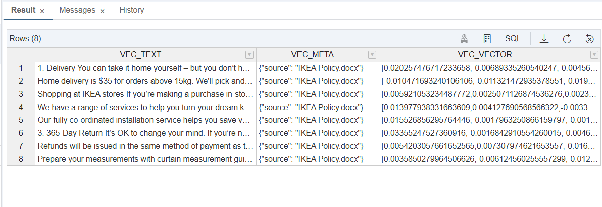
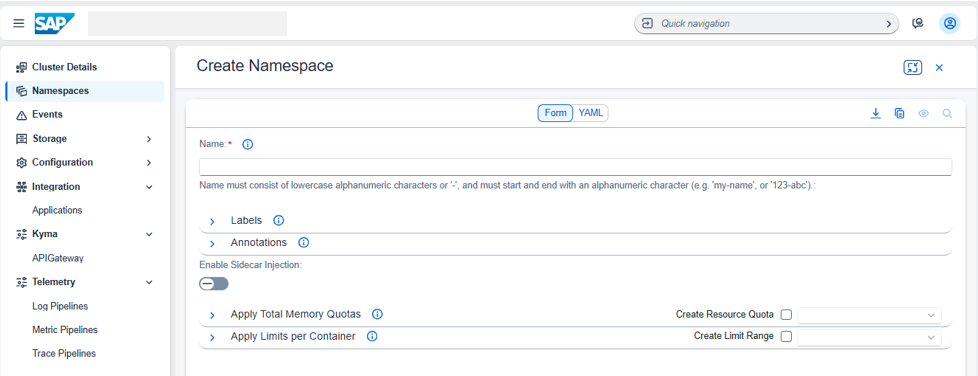
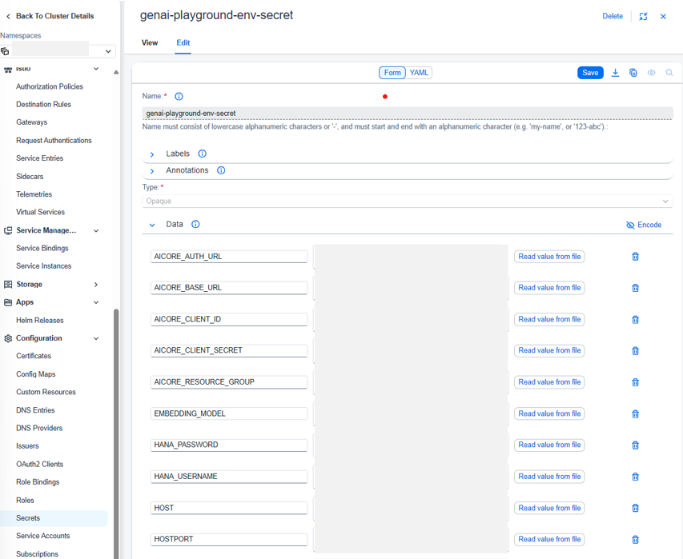
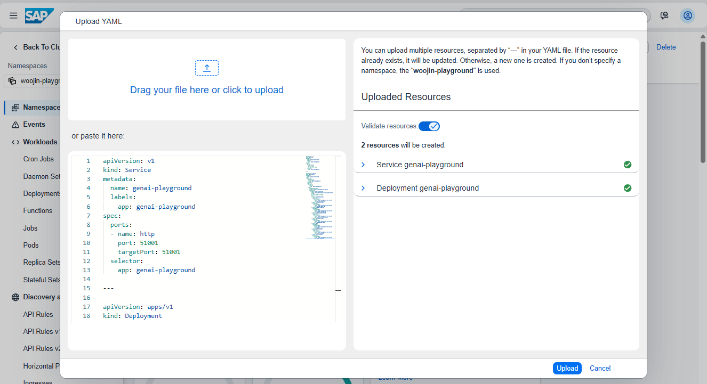
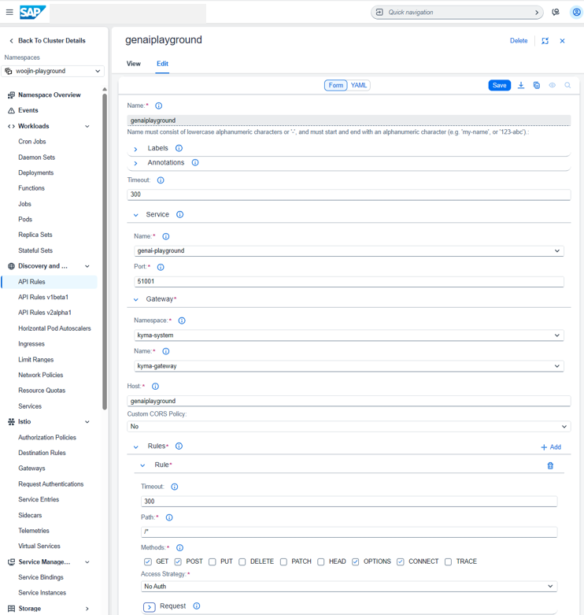
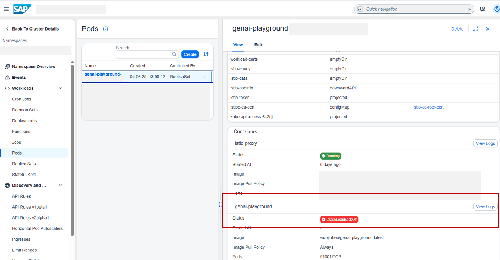
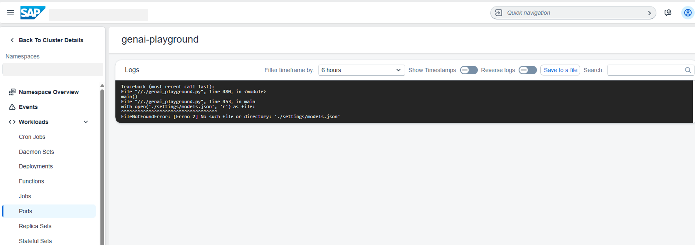

# AI Playground Setup Guide

This guide provides detailed instructions for setting up and deploying the AI Playground Template.

## Table of Contents

1. [Prerequisites](#prerequisites)
   - [SAP AI Core Provisioning](#1-sap-ai-core-provisioning)
   - [Generative AI Hub Setup](#2-generative-ai-hub-setup)  
   - [HANA Database Configuration](#3-hana-database-configuration)
2. [Local Installation](#local-installation)
3. [Deployment Options](#deployment-options)
   - [Docker Deployment](#docker-deployment)
   - [SAP BTP Kyma Deployment](#sap-btp-kyma-deployment)
4. [Troubleshooting](#troubleshooting)
___
# Prerequisites

### 1. SAP AI Core Provisioning

SAP AI Core serves as the foundation for Generative AI Hub access.

**Setup Instructions:**
- Follow this [SAP tutorial Step 1](https://developers.sap.com/tutorials/ai-core-generative-ai.html#1c4f36d7-f345-4822-be00-c15f133ff7d8)
- Complete the "Set up SAP AI Core" section to provision the service

**Credential Mapping:**
After provisioning, you'll receive credentials like this:



Map these to your `.env` file:
- `AICORE_CLIENT_ID` ← `clientid`
- `AICORE_CLIENT_SECRET` ← `clientsecret`  
- `AICORE_AUTH_URL` ← `url`/oauth/token
- `AICORE_BASE_URL` ← `AI_AP`

### 2. Generative AI Hub Setup

Configure the Generative AI Hub to deploy and manage LLM models.

**Setup Instructions:**
- Continue with the same tutorial through [Step 4](https://developers.sap.com/tutorials/ai-core-generative-ai.html#1c4f36d7-f345-4822-be00-c15f133ff7d8)
- Deploy your desired LLM models

**Model Configuration:**
After deployment, find your models in SAP AI Launchpad:



1. Navigate to **ML Operations > Deployments**
2. Locate your deployed LLM models (e.g. `anthropic-claude-3-opus`,`gpt-4o`)
3. Update `settings/models.json` with your deployed models:

```json
[
    {
        "model": "gpt-4", 
        "name": "Azure OpenAI GPT-4 8k", 
        "desc": "GPT-4 is a large multimodal model that can solve difficult problems with greater accuracy.", 
        "platform": "SAP Generative AI Hub",
        "hasImage": false
    },
    {
        "model": "anthropic--claude-3-opus", 
        "name": "Anthropic Claude 3", 
        "desc": "Anthropic's powerful AI assistant, designed for complex thinking and detailed analysis.", 
        "platform": "SAP Generative AI Hub",
        "hasImage": false
    }
]
```

**Field Descriptions:**
- `model`: Deployment name from SAP AI Launchpad
- `platform`: Determines API configuration and proxy settings
- `name`/`desc`/`hasImage`: UI display information

### 3. HANA Database Configuration

The vector store uses SAP HANA Database for RAG implementation. To configure the database connection, obtain the following credentials from your system administrator.

**Required Credentials:**
- `HOST`: `<your-hana-cloud-url>.eu10.hanacloud.ondemand.com`
- `HANA_USERNAME`: Your database username
- `HANA_PASSWORD`: Your database password

**Vector Store Structure:**
The vector store table is automatically created and managed by the service - no manual table creation or schema setup is required. The system automatically generates a table with the following structure.
- `VEC_TEXT`: Text content/chunks for retrieval
- `VEC_META`: Metadata and source document references  
- `VEC_Vector`: High-dimensional vector embeddings


___
# Local Installation

1. **Clone and Install Dependencies:**
```bash
git clone <repository-url>
cd ai-playground-template
pip install --no-deps -r requirements.txt
```

2. **Configure Environment:**
Create a `.env` file in the project root:

```env
# Embedding Model
EMBEDDING_MODEL=text-embedding-ada-002

# SAP AI Core / GenAI Hub Credentials
AICORE_CLIENT_ID=sb-21b3e....|aicore!b540
AICORE_CLIENT_SECRET=...
AICORE_AUTH_URL=https://<your-url>.authentication.eu10.hana.ondemand.com/oauth/token
AICORE_BASE_URL=https://<your-api-url>.ml.hana.ondemand.com/v2
AICORE_RESOURCE_GROUP=<your-resource-group>

# Host Configuration
HOSTPORT=51001

# HANA Cloud Vector Store
HOST=<your-hana-cloud-url>.eu10.hanacloud.ondemand.com
HANA_USERNAME=<your-username>
HANA_PASSWORD=<your-password>
```

3. **Run the Application:**
```bash
python genai_playground.py
```

Access the interface at `http://localhost:51040`
___
# Production Deployment
To deploy the AI Playground in production, you'll first create a Docker image and then deploy it on SAP BTP Kyma.

### Docker Image Creation

1. **Create Dockerfile:**
```dockerfile
FROM python:3.11

COPY requirements.txt .
RUN pip install --no-deps -r requirements.txt

COPY settings/ ./settings/
COPY img/ ./img/
COPY genai_playground.py /
COPY genai_utils.py /

CMD ["python", "./genai_playground.py"]
```

2. **Build and Push to Docker Hub:**
```bash
# Build image
docker build -t <your-dockerhub-username>/genai-playground .

# Login and push
docker login
docker push <your-dockerhub-username>/genai-playground
```

### SAP BTP Kyma Deployment
Once your Docker image is ready, deploy it on Kyma.

**Useful Materials:**
- Follow [Enable SAP BTP, Kyma Runtime](https://developers.sap.com/tutorials/cp-kyma-getting-started.html)
- Review [Plug-and-Deploy a Machine Learning Model with Kyma](https://discovery-center.cloud.sap/protected/index.html#/missiondetail/3700/)

**Deployment Steps:**

1. **Create Namespace** in Kyma Dashboard. 
Namespace provide isolated environments for different applications or teams within the same Kyma cluster.
    
2. **Configure Secrets:**
   Instead of `.env` file, create Kyma secrets with your environment variables.   
   

3. **Create Deployment YAML**:
   Create a deployment configuration file (`deployment.yaml`) with the following structure:
   ```yaml
   apiVersion: v1
   kind: Service
   metadata:
   name: genai-playground
   labels:
      app: genai-playground
   spec:
   ports:
   - name: http
      port: 51001
      targetPort: 51001
   selector:
      app: genai-playground

   ---

   apiVersion: apps/v1
   kind: Deployment
   metadata:
   name: genai-playground
   spec:
   selector:
      matchLabels:
         app: genai-playground
   replicas: 2
   template:
      metadata:
         labels:
         app: genai-playground
      spec:
         imagePullSecrets:
         - name: genai-playground-env-secret
         containers:
         - name: genai-playground
            image: <your-dockerhub-username>/genai-playground:latest
            ports:
            - containerPort: 51001
            env:
            - name: AICORE_BASE_URL
               valueFrom:
               secretKeyRef:
                  name: genai-playground-env-secret
                  key: AICORE_BASE_URL
            - name: AICORE_AUTH_URL
               valueFrom:
               secretKeyRef:
                  name: genai-playground-env-secret
                  key: AICORE_AUTH_URL
            - name: AICORE_CLIENT_ID
               valueFrom:
               secretKeyRef:
                  name: genai-playground-env-secret
                  key: AICORE_CLIENT_ID
            - name: AICORE_CLIENT_SECRET
               valueFrom:
               secretKeyRef:
                  name: genai-playground-env-secret
                  key: AICORE_CLIENT_SECRET
            - name: EMBEDDING_MODEL
               valueFrom:
               secretKeyRef:
                  name: genai-playground-env-secret
                  key: EMBEDDING_MODEL
            - name: HOST
               valueFrom:
               secretKeyRef:
                  name: genai-playground-env-secret
                  key: HOST
            - name: HANA_USERNAME
               valueFrom:
               secretKeyRef:
                  name: genai-playground-env-secret
                  key: HANA_USERNAME
            - name: HANA_PASSWORD
               valueFrom:
               secretKeyRef:
                  name: genai-playground-env-secret
                  key: HANA_PASSWORD
      ```
   **Key Configuration Points:**
   - `image`: Replace with your Docker Hub image name
   - `secretKeyRef.name`: Must match the secret name created in earlier step
   - `secretKeyRef.key`: Must match the exact key names in your Kyma secret
   - `replicas: 2`: Runs 2 pod instances for high availability
   - `containerPort: 51001`: Must match the port your Gradio app uses

4. **Deploy Application:**
   Upload your deployment YAML to the namespace
   

5. **Create API Rule:**
   Configure external access to your application
      
   **Required HTTP Methods for Gradio:**
   - `GET`: Load the web interface, static assets (CSS, JS, images)
   - `POST`: Submit chat messages, upload documents, API calls

   **Note:** For production deployments, consider configuring authentication and authorization instead of "No Auth". See this [detailed blog post](https://www.linkedin.com/pulse/sap-btp-kyma-authentication-authorization-autoscaling-gunter-albrecht-wrbic/) for comprehensive security setup.
___
# Troubleshooting

### Finding Error Logs in Kyma

1. Navigate to your deployment in Kyma Dashboard
2. Click on **View Logs**




### Common Issues

#### Issue 1: Document Upload Metadata Error

**Error:**
```bash
ERROR:root:Adding document embeddings failed with error: Invalid metadata key folder information.
```

**Cause:** Document metadata contains keys with spaces or special characters incompatible with vector DB.

**Solution:** Update the `sanitize_metadata_keys` function in `genai_utils.py` to handle special characters.

**Debug Script:**
```python
for doc in documents:
    problematic_keys = [k for k in doc.metadata.keys() if ' ' in k or '-' in k]
    if problematic_keys:
        print(f"Problematic keys: {problematic_keys}")
```

#### Issue 2: Language Model Not Available

**Error:**
```bash
KeyError: "Model 'anthropic--claude-3-opus_autogenerated' is not available!"
```

**Cause:** The model specified in `models.json` doesn't match your deployed models in SAP AI Launchpad.

**Solution:**
1. Check your deployed models in SAP AI Launchpad
2. Update `settings/models.json` with exact deployment names
3. Ensure the models are in "Running" status

---